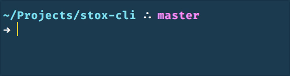

## Stox CLI

A Node.js command line interface to query stock financial information and performance using web scraping. Built to help analyze stocks in order to make informed purchase orders. The goal is to create a robust suite of tools that mimics the approach professionals use.

### Demo


### Installation
Ensure you have Node.js version 4+ installed. Then run the following:
```
$ npm install -g stox-cli
```

### Usage
```
Usage: stox [options] [command]


  Commands:

    now <ticker>           Fetches a stock's current performance on the day
    fundamentals <ticker>  Fetches a stock's fundamentals
    headlines <ticker>     Fetches a stock's latest headlines
    trending               Fetches a list of trending tickers from StockTwits
```

### License
MIT
